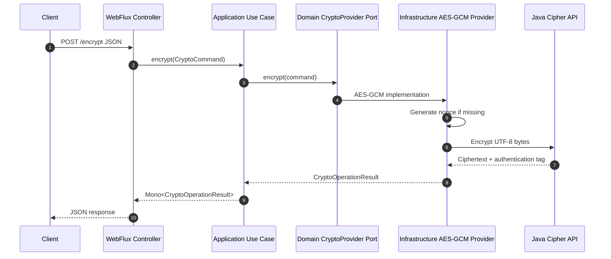

# AES Crypto WebFlux Service

Spring Boot WebFlux service for AES encryption and decryption using `AES/GCM/NoPadding`.

This version keeps the same small HTTP API as the earlier AES service, but organizes the code using clean architecture boundaries.

## Proposed Clean Architecture Structure

```text
src/main/java/net/celloscope/aes/
├── AesCryptoWebfluxApplication.java
├── adapter/
│   └── in/
│       └── web/
│           ├── CryptoController.java
│           ├── dto/
│           │   ├── request/
│           │   │   ├── DecryptRequest.java
│           │   │   └── EncryptRequest.java
│           │   └── response/
│           │       ├── CryptoMetadata.java
│           │       ├── CryptoResponse.java
│           │       └── ErrorResponse.java
│           └── handler/
│               └── GlobalExceptionHandler.java
├── application/
│   ├── port/
│   │   └── in/
│   │       ├── DecryptDataUseCase.java
│   │       └── EncryptDataUseCase.java
│   └── service/
│       └── AesCryptoService.java
├── domain/
│   ├── exception/
│   │   ├── CryptoOperationException.java
│   │   └── InvalidCryptoInputException.java
│   ├── model/
│   │   ├── CryptoCommand.java
│   │   └── CryptoOperationResult.java
│   └── port/
│       └── CryptoProvider.java
└── infrastructure/
    ├── config/
    │   ├── AesCryptoProperties.java
    │   └── CryptoConfig.java
    └── crypto/
        └── AesGcmCryptoProvider.java
```

Why this is better than the original Triple-DES version:

- The web layer is only an inbound adapter. It handles HTTP, validation, JSON mapping, and reactive response types.
- The application layer owns the use cases: encrypt and decrypt.
- The domain layer owns stable business concepts and ports.
- The infrastructure layer owns AES-GCM details and Spring configuration.
- The crypto implementation can be replaced by another `CryptoProvider` without changing the controller.
- Tests can target each boundary independently.

## Technology

- Spring Boot: `3.5.14`
- Java: `25`
- Gradle wrapper: `9.2.0`
- Web stack: Spring WebFlux
- Reactive type: Reactor `Mono`
- Cipher: `AES/GCM/NoPadding`
- Data encoding: UTF-8 strings
- Ciphertext encoding: Base64
- Nonce/IV encoding: Base64

## API

Base path:

```text
/api/v1/crypto/aes
```

### Encrypt

```http
POST /api/v1/crypto/aes/encrypt
```

Request:

```json
{
  "data": "HelloWorld",
  "secretKey": "0123456789abcdef0123456789abcdef"
}
```

Optional fixed nonce/IV for controlled tests:

```json
{
  "data": "HelloWorld",
  "secretKey": "0123456789abcdef0123456789abcdef",
  "iv": "MTIzNDU2Nzg5MDEy"
}
```

Response:

```json
{
  "result": "Base64 ciphertext and authentication tag",
  "algorithm": "AES/GCM/NoPadding",
  "metadata": {
    "iv": "Base64 nonce",
    "tagLengthBits": 128
  }
}
```

### Decrypt

```http
POST /api/v1/crypto/aes/decrypt
```

Request:

```json
{
  "data": "Base64 ciphertext and authentication tag",
  "secretKey": "0123456789abcdef0123456789abcdef",
  "iv": "Base64 nonce returned by encryption"
}
```

Response:

```json
{
  "result": "HelloWorld",
  "algorithm": "AES/GCM/NoPadding",
  "metadata": {
    "iv": "Base64 nonce used for decryption",
    "tagLengthBits": 128
  }
}
```

## cURL Examples

Start the service:

```bash
./gradlew bootRun
```

Encrypt:

```bash
curl -s -X POST "http://localhost:8081/api/v1/crypto/aes/encrypt" \
  -H "Content-Type: application/json" \
  -d '{
    "data": "HelloWorld",
    "secretKey": "0123456789abcdef0123456789abcdef"
  }'
```

Decrypt:

```bash
curl -s -X POST "http://localhost:8081/api/v1/crypto/aes/decrypt" \
  -H "Content-Type: application/json" \
  -d '{
    "data": "<result from encrypt>",
    "secretKey": "0123456789abcdef0123456789abcdef",
    "iv": "<metadata.iv from encrypt>"
  }'
```

## Flow Diagram



## Security Notes

- AES-GCM uses a 12-byte nonce and 128-bit authentication tag by default.
- Encryption generates a secure random nonce unless `iv` is explicitly provided.
- The encrypted `result` contains ciphertext plus the GCM authentication tag, Base64 encoded.
- The `iv` is not secret, but it must be unique for the same key. Reusing an AES-GCM nonce with the same key is unsafe.
- `secretKey` is treated as a UTF-8 AES key and must be exactly 16, 24, or 32 bytes.
- Do not log plaintext, ciphertext, secret keys, or IVs in production logs.
- For production systems, prefer managed key storage such as Vault, KMS, or an HSM instead of accepting raw keys from clients.

## Run Tests

```bash
./gradlew test
```
