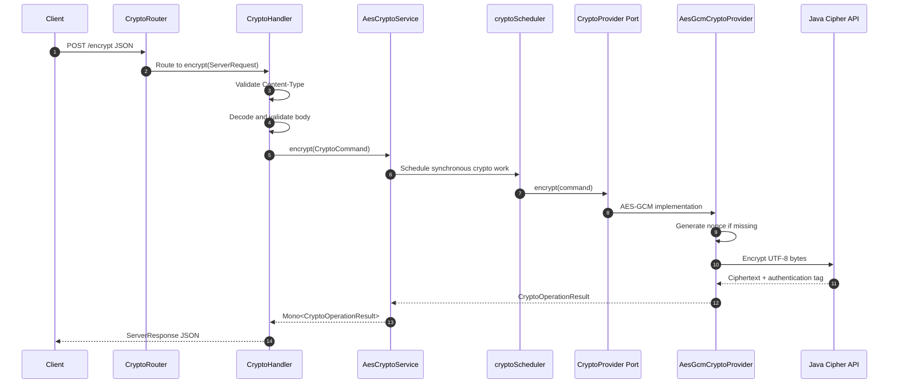

# AES Crypto WebFlux Service

Spring Boot WebFlux service for AES encryption and decryption using `AES/GCM/NoPadding`.

The service keeps the small API surface of the existing Triple-DES project, but uses a cleaner router-handler WebFlux design with explicit application ports, an outbound AES-GCM adapter, centralized error mapping, traceable logs, and focused tests.

## Technology

- Spring Boot: `3.5.14`
- Java: `25`
- Gradle wrapper: `9.2.0`
- Web stack: Spring WebFlux functional routing
- Reactive type: Reactor `Mono`
- Cipher: `AES/GCM/NoPadding`
- Data encoding: UTF-8 strings
- Ciphertext encoding: Base64
- Nonce/IV encoding: Base64

## Current Structure

```text
src/main/java/net/celloscope/aes/
├── AesCryptoWebfluxApplication.java
├── adapter/
│   ├── in/
│   │   └── web/
│   │       ├── dto/
│   │       │   ├── request/
│   │       │   │   ├── CryptoRequest.java
│   │       │   │   ├── DecryptRequest.java
│   │       │   │   └── EncryptRequest.java
│   │       │   └── response/
│   │       │       ├── CryptoMetadata.java
│   │       │       ├── CryptoResponse.java
│   │       │       └── ErrorResponse.java
│   │       ├── handler/
│   │       │   └── CryptoHandler.java
│   │       └── router/
│   │           └── CryptoRouter.java
│   └── out/
│       └── crypto/
│           └── AesGcmCryptoProvider.java
├── application/
│   ├── port/
│   │   ├── in/
│   │   │   ├── DecryptDataUseCase.java
│   │   │   └── EncryptDataUseCase.java
│   │   └── out/
│   │       └── CryptoProvider.java
│   └── service/
│       └── AesCryptoService.java
├── domain/
│   └── model/
│       ├── CryptoCommand.java
│       └── CryptoOperationResult.java
├── infrastructure/
│   ├── config/
│   │   ├── AesCryptoProperties.java
│   │   ├── CryptoConfig.java
│   │   └── CryptoSchedulerProperties.java
│   └── exception/
│       ├── CryptoOperationException.java
│       ├── ErrorResponseMapper.java
│       ├── InvalidCryptoInputException.java
│       ├── RequestValidationException.java
│       └── UnsupportedContentTypeException.java
└── util/
    └── HelperUtil.java
```

## Architecture

- `CryptoRouter` declares the HTTP routes using `RouterFunction<ServerResponse>`.
- `CryptoHandler` reads request bodies with `ServerRequest.bodyToMono(...)`, validates DTOs, maps requests to `CryptoCommand`, invokes the application use case, and returns `ServerResponse`.
- `EncryptDataUseCase` and `DecryptDataUseCase` are inbound application ports.
- `AesCryptoService` implements both use cases and schedules synchronous JCA crypto work away from Netty event-loop threads.
- `CryptoProvider` is the outbound application port for crypto operations.
- `AesGcmCryptoProvider` implements the outbound port using Java Cryptography Architecture.
- `ErrorResponseMapper` maps validation, content type, crypto input, crypto operation, and unexpected failures into consistent JSON errors.
- `HelperUtil` holds shared mapping, validation, response, request-id, and logging helpers.

## Reactive Design

- Request decoding stays in the reactive chain through `bodyToMono(...)`.
- DTO validation is done inside the reactive chain with `jakarta.validation.Validator`, avoiding MVC-style method validation on `Mono<T>`.
- Application use cases return `Mono<CryptoOperationResult>`.
- JCA `Cipher` operations are synchronous, so `AesCryptoService` wraps provider calls with `Mono.fromCallable(...)`.
- Crypto work runs on a dedicated bounded elastic scheduler named `aes-crypto`.
- Routes match by method/path, and content type is validated explicitly so non-JSON requests receive `415 Unsupported Media Type` instead of confusing route misses.

## Configuration

`src/main/resources/application.properties`:

```properties
spring.application.name=aes-crypto-webflux-service
server.port=8081

crypto.aes.nonce-length-bytes=12
crypto.aes.tag-length-bits=128
crypto.scheduler.thread-cap=0
crypto.scheduler.queue-capacity=1000

logging.level.net.celloscope.aes=INFO
```

Config notes:

- `crypto.aes.nonce-length-bytes` must be `12` for AES-GCM.
- `crypto.aes.tag-length-bits` must be one of `96`, `104`, `112`, `120`, or `128`.
- `crypto.scheduler.thread-cap=0` means auto-size to `max(4, availableProcessors)`.
- `crypto.scheduler.queue-capacity` controls the bounded scheduler queue for crypto tasks.

## API

Base path:

```text
/api/v1/crypto/aes
```

Required request header:

```http
Content-Type: application/json
```

### Encrypt

```http
POST /api/v1/crypto/aes/encrypt
```

Request:

```json
{
  "data": "HelloWorld",
  "secretKey": "0123456789abcdef0123456789abcdef"
}
```

Optional fixed nonce/IV for controlled tests:

```json
{
  "data": "HelloWorld",
  "secretKey": "0123456789abcdef0123456789abcdef",
  "iv": "MTIzNDU2Nzg5MDEy"
}
```

Response:

```json
{
  "result": "Base64 ciphertext and authentication tag",
  "algorithm": "AES/GCM/NoPadding",
  "metadata": {
    "iv": "Base64 nonce",
    "tagLengthBits": 128
  }
}
```

### Decrypt

```http
POST /api/v1/crypto/aes/decrypt
```

Request:

```json
{
  "data": "Base64 ciphertext and authentication tag",
  "secretKey": "0123456789abcdef0123456789abcdef",
  "iv": "Base64 nonce returned by encryption"
}
```

Response:

```json
{
  "result": "HelloWorld",
  "algorithm": "AES/GCM/NoPadding",
  "metadata": {
    "iv": "Base64 nonce used for decryption",
    "tagLengthBits": 128
  }
}
```

## Error Response

All handled errors return this JSON shape:

```json
{
  "timestamp": "2026-06-02T12:00:00Z",
  "status": 400,
  "error": "Bad Request",
  "message": "Request validation failed",
  "path": "/api/v1/crypto/aes/encrypt",
  "details": [
    "secretKey: secretKey is required"
  ]
}
```

Status codes:

- `200 OK`: encryption or decryption succeeded.
- `400 Bad Request`: validation failed, JSON is malformed, Base64 input is invalid, AES key length is invalid, IV is missing, IV length is invalid, or authentication tag verification fails.
- `415 Unsupported Media Type`: `Content-Type` is missing or not compatible with `application/json`.
- `500 Internal Server Error`: unexpected crypto/runtime failure.

## cURL Examples

Start the service:

```bash
./gradlew bootRun
```

Encrypt:

```bash
curl -s -X POST "http://localhost:8081/api/v1/crypto/aes/encrypt" \
  -H "Content-Type: application/json" \
  -H "Trace-Id: trace-aes-001" \
  -d '{
    "data": "HelloWorld",
    "secretKey": "0123456789abcdef0123456789abcdef"
  }'
```

Decrypt:

```bash
curl -s -X POST "http://localhost:8081/api/v1/crypto/aes/decrypt" \
  -H "Content-Type: application/json" \
  -H "Trace-Id: trace-aes-002" \
  -d '{
    "data": "<result from encrypt>",
    "secretKey": "0123456789abcdef0123456789abcdef",
    "iv": "<metadata.iv from encrypt>"
  }'
```

Validation error example:

```bash
curl -s -X POST "http://localhost:8081/api/v1/crypto/aes/encrypt" \
  -H "Content-Type: application/json" \
  -d '{}'
```

Unsupported content type example:

```bash
curl -s -X POST "http://localhost:8081/api/v1/crypto/aes/encrypt" \
  -H "Content-Type: text/plain" \
  -d 'HelloWorld'
```

## Logging

Request logs include:

- `requestId`
- `operation`
- HTTP method
- path
- content type
- data length
- secret key length
- IV presence and length

Response logs include:

- `requestId`
- `operation`
- algorithm
- result length
- IV presence and length
- tag length

Error logs include:

- `requestId`
- HTTP method
- path
- status
- message
- validation details when available

Sensitive values are not logged:

- Raw `secretKey`
- Plaintext
- Ciphertext
- Raw IV/nonce value

Request id resolution order:

1. `Trace-Id` header
2. `Request-Id` header
3. WebFlux request id

Sample request log:

```text
Crypto request received requestId=trace-aes-001 operation=encrypt method=POST path=/api/v1/crypto/aes/encrypt contentType=application/json
Crypto request body requestId=trace-aes-001 operation=encrypt dataLength=10 secretKeyLength=32 ivPresent=false ivLength=0
Crypto response prepared requestId=trace-aes-001 operation=encrypt algorithm=AES/GCM/NoPadding resultLength=40 ivPresent=true ivLength=16 tagLengthBits=128
```

## Flow Diagram



## Security Notes

- AES-GCM uses a 12-byte nonce and 128-bit authentication tag by default.
- Encryption generates a secure random nonce unless `iv` is explicitly provided.
- The encrypted `result` contains ciphertext plus the GCM authentication tag, Base64 encoded.
- The `iv` is not secret, but it must be unique for the same key. Reusing an AES-GCM nonce with the same key is unsafe.
- `secretKey` is treated as a UTF-8 AES key and must be exactly 16, 24, or 32 bytes.
- Do not log plaintext, ciphertext, secret keys, or raw IV values in production logs.
- For production systems, prefer managed key storage such as Vault, KMS, or an HSM instead of accepting raw keys from clients.
- Prefer TLS for all external calls to this service.

## Tests

Run all tests:

```bash
./gradlew test
```

Test coverage includes:

- AES-GCM encrypt/decrypt round trip.
- Secure random nonce generation.
- Provided Base64 nonce usage.
- Invalid AES key length.
- Tampered ciphertext/tag rejection.
- Missing decrypt IV.
- WebFlux encrypt/decrypt HTTP flow.
- Request validation errors.
- Invalid JSON error response.
- Unsupported content type error response.
